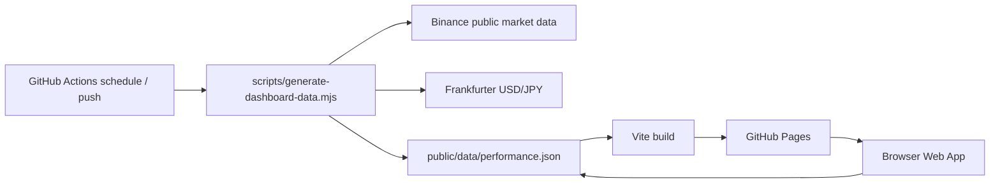

# Architecture

`crypto-auto-trade-sim` は、GitHub Actionsで日次データを生成し、Vite/Reactの静的WebアプリとしてGitHub Pagesへ公開する暗号資産ドライラン監視アプリです。



## Components

- **React Web App**: `src/App.tsx` が `public/data/performance.json` を読み込み、評価額、損益、リターン、リスク、売買シグナル、シナリオ設定を表示します。
- **Portfolio Logic**: `src/portfolio.ts` に配分正規化、リターン、最大ドローダウン、年率ボラティリティ、売買シグナル、リスクスコアを集約しています。
- **Data Generator**: `scripts/generate-dashboard-data.mjs` が公開マーケットデータとUSD/JPYを取得し、失敗時はフォールバックデータでJSONを生成します。
- **Static Data**: `public/data/performance.json` は初期表示用のサンプル兼、Actionsによる日次生成先です。
- **CI/CD**: `.github/workflows/ci.yml` は型チェック、テスト、データ生成、ビルドを実行します。`.github/workflows/pages-dashboard.yml` はGitHub Pagesへデプロイします。

## Runtime

本番発注は行いません。`ENABLE_LIVE_TRADING=false` と `TRADING_DRY_RUN=true` をworkflow envに固定し、Webアプリは監視・検証専用として動作します。

## Public URL

GitHub Pages URLは次です。

```text
https://univcorp2-ctrl.github.io/crypto-auto-trade-sim/
```

Viteのbase pathは `/crypto-auto-trade-sim/` に固定されています。

## Secrets

必須Secretはありません。Slack/Discordなどに通知したい場合のみ、GitHub Actions Secretに次を設定します。

- `PERFORMANCE_WEBHOOK_URL`

## Extension Ideas

- 銘柄追加と配分変更を `config/portfolio.json` で管理
- GitHub Issueへの履歴追記
- CSV/Excelレポートのartifact出力
- Binance Testnet APIを使った注文検証。ただし本番発注は別reviewとsecret設計が必要
