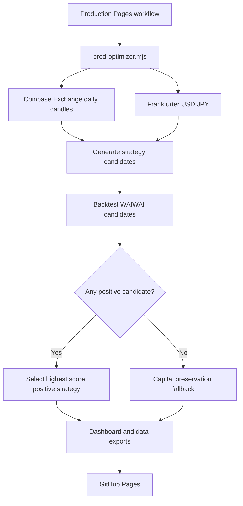

# Architecture

Current production entrypoint:

```text
.github/workflows/production-pages.yml -> node scripts/prod-optimizer.mjs -> dist -> GitHub Pages
```



The optimizer searches multiple lookback, moving-average, max-position, and rebalance-threshold settings. It selects a positive strategy when one exists in the tested real-market period. This is still a real-market simulation, not a private account statement.
