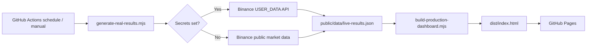

# Architecture

## Data modes

- `binance-real-account`: Binance Spot USER_DATA APIから実口座の残高と約定履歴を取得します。
- `real-market-backtest`: Binanceの実市場価格データでワイワイ自動売買戦略をバックテストします。架空の実口座成績は出しません。

## Security

API keyとsecretはGitHub Actions Secretsからのみ読みます。生成されるWebにはAPIキーを含めません。

## Outputs

- `/` dashboard
- `/data/live-results.json`
- `/data/trades.csv`
- `/data/trades.xls`
