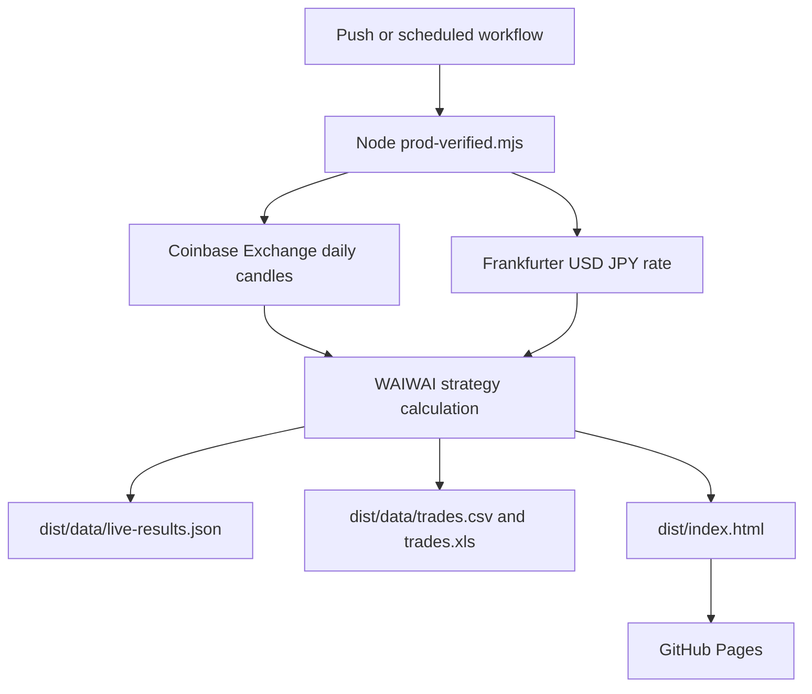

# Architecture

The production dashboard is built by `.github/workflows/production-pages.yml` and `scripts/prod-verified.mjs`.

## Data proof

The dashboard and JSON include `dataProvenance`. It shows source, product, candle row count, first date, last date, and last close for BTC, ETH, and SOL.

## User controls

The page supports chart range buttons, asset filter buttons, trade search, buy or sell filtering, raw JSON modal, URL copy, reload, and JSON CSV Excel downloads.
