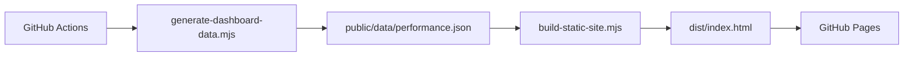

# Architecture

```mermaid
flowchart LR
  A[GitHub Actions] --> B[generate-dashboard-data.mjs]
  B --> C[public/data/performance.json]
  C --> D[build-static-site.mjs]
  D --> E[dist/index.html]
  E --> F[GitHub Pages]
```

Public URL: `https://univcorp2-ctrl.github.io/crypto-auto-trade-sim/`
