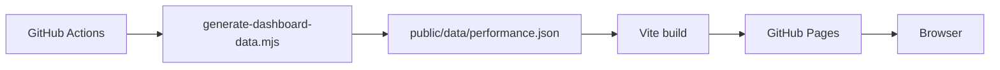

# Architecture

- Web app: `src/main.ts`
- Portfolio utilities: `src/portfolio.ts`
- Static data: `public/data/performance.json`
- Deploy: `.github/workflows/pages-dashboard.yml`

Public URL: `https://univcorp2-ctrl.github.io/crypto-auto-trade-sim/`
