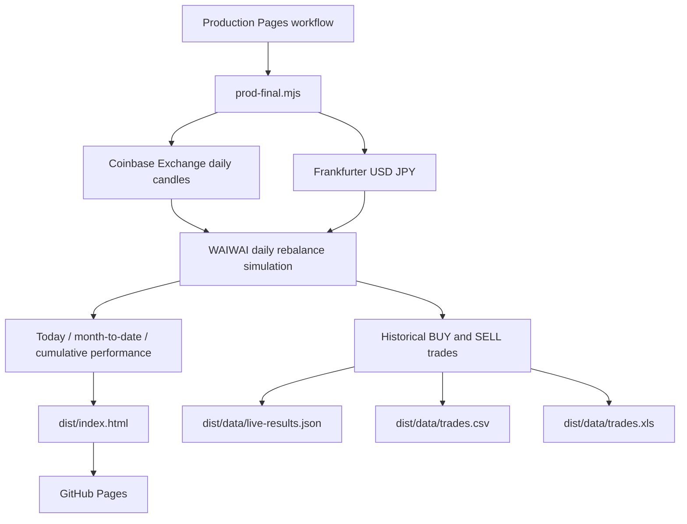

# Architecture

Current production entrypoint:

```text
.github/workflows/production-pages.yml -> node scripts/prod-final.mjs -> dist -> GitHub Pages
```



The public dashboard is real-market simulation mode. It uses real market candles, but it is not a private exchange account statement unless private account credentials are integrated separately.

The page includes user controls for chart range, asset filter, buy/sell filter, trade search, raw JSON, URL copy, reload, and data export.
