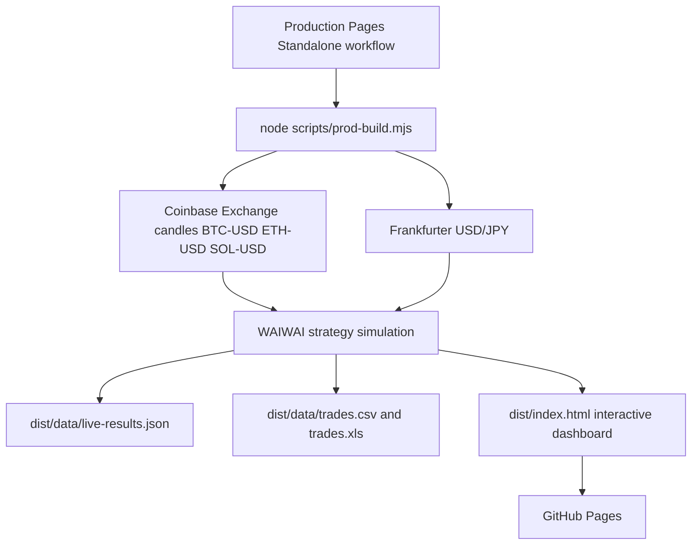

# Architecture

このダッシュボードは、ブラウザで取引所APIを直接呼びません。GitHub Actions上で公開マーケットデータを取得し、計算済みの結果だけをGitHub Pagesに配置します。

## Data verification

`live-results.json` contains `dataProvenance` with these fields.

- `priceSource`: price data provider
- `fxSource`: FX provider
- `fetchedAt`: generation timestamp
- `candleRowsTotal`: total candle rows used
- `perSymbol`: product, row count, first date, last date, and last close

## Current data mode

Current public mode is `real-market-backtest`. It means the app uses real market candles to calculate what would have happened if the WAIWAI strategy had traded. It is not a private exchange account statement unless private exchange secrets are added in a future backend or secure action.

## User interactions

The generated dashboard supports range filtering, asset filtering, trade search, buy or sell filtering, raw JSON modal, URL copy, reload, and export links.
